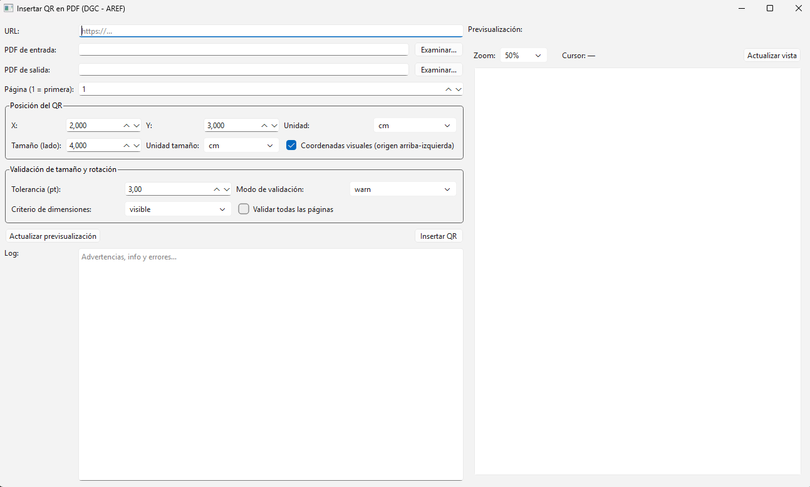

# Insert QR into PDF

## Descripción general

**Insert QR into PDF** es una herramienta desarrollada en **Python** que permite generar un **código QR a partir de una URL** e **insertarlo en un archivo PDF existente**, en una página y posición específicas.

El proyecto está orientado a escenarios donde se requiere **agregar códigos QR de forma automatizada o asistida visualmente** sobre documentos ya generados, tales como:

- Formularios administrativos  
- Documentación institucional  
- Certificados y constancias  
- Informes técnicos y académicos  
- Documentos legales o contractuales  

El sistema ofrece dos modos de trabajo complementarios:

- **Script CLI** (`insert_qr_pdf.py`) → automatización y ejecución por línea de comandos.  
- **Cliente gráfico (GUI)** (`gui_insert_qr.py`) → posicionamiento visual, previsualización y arrastre del QR.

---

## Componentes del proyecto

| Archivo | Descripción |
|------|------------|
| `insert_qr_pdf.py` | Script principal de inserción de QR en PDFs (CLI / backend). |
| `gui_insert_qr.py` | Cliente gráfico PySide6/Qt con previsualización y drag & drop. |
| `requirements.txt` | Dependencias del proyecto. |
| `README.md` | Documentación del proyecto. |

---

## Características principales

### Funcionalidad general

- Generación de códigos QR desde una URL.
- Inserción del QR en:
  - Página específica del PDF.
  - Coordenadas definidas por el usuario.
- Soporte de unidades:
  - **cm**
  - **mm**
  - **puntos (pt)**
- Inserción no destructiva mediante **overlay PDF**.
- Compatible con PDFs multipágina.

### Validación de documento

- Validación del tamaño de página:
  - **A4**
  - **Carta**
- Comparación con **tolerancia configurable**.
- Detección de páginas con rotación (`/Rotate`).
- Modos de validación:
  - **warn**: emite advertencia y continúa.
  - **strict**: aborta el proceso si no cumple.

---

## Requisitos

### Entorno

- Python **3.10 o superior**

### Dependencias (requirements.txt)

```
certifi==2026.1.4
charset-normalizer==3.4.4
colorama==0.4.6
idna==3.11
pillow==12.1.0
PyMuPDF==1.26.7
pypdf==6.5.0
PySide6==6.10.1
PySide6_Addons==6.10.1
PySide6_Essentials==6.10.1
qrcode==8.2
reportlab==4.4.7
requests==2.32.5
shiboken6==6.10.1
urllib3==2.6.2
```

### Instalación

```bash
pip install -r requirements.txt
```

---

## Uso del script `insert_qr_pdf.py` (CLI)

### Ejemplo básico

```bash
python insert_qr_pdf.py   --url "https://www.ejemplo.com"   --in-pdf "entrada.pdf"   --out-pdf "salida.pdf"   --page 1   --x 2 --y 3 --unit cm   --size 4 --size-unit cm
```

---

## Cliente gráfico `gui_insert_qr.py` (GUI)

### Descripción

El cliente gráfico permite trabajar de forma visual con el PDF, evitando el ensayo/error numérico y facilitando la ubicación precisa del QR.

### Características destacadas

- Previsualización real del PDF.
- Rectángulo del QR arrastrable.
- Coordenadas del cursor en tiempo real.
- Conversión automática entre coordenadas visuales y PDF.
- Integración completa con las validaciones del backend.

### Caso de uso típico

Un usuario administrativo necesita agregar un QR siempre en la misma posición de certificados ya emitidos.  
Mediante el GUI puede posicionar el QR visualmente, verificar el resultado y generar el PDF final sin cálculos manuales.

### Captura de pantalla del GUI (comentada)



> **Figura 1 – Interfaz gráfica `gui_insert_qr.py` con previsualización y posicionamiento visual del QR**

#### Referencias de la interfaz

1. **URL del código QR**
   Campo de texto donde se ingresa la URL que será codificada en el QR.

2. **Selección de PDF de entrada y salida**
   Permite elegir el documento original y definir el archivo PDF resultante.

3. **Página destino**
   Indica la página del PDF donde se insertará el QR (1 = primera página).

4. **Parámetros de posición y tamaño**

   * Coordenadas **X / Y**
   * Unidad de medida (**cm, mm, pt**)
   * Tamaño del QR (lado del cuadrado)

5. **Modo de coordenadas visuales**
   Al estar activado, las coordenadas se interpretan con origen **arriba-izquierda**, coincidiendo con la vista en pantalla.
   El sistema convierte automáticamente a coordenadas PDF internas.

6. **Validación del documento**
   Configuración de:

   * Tolerancia en puntos
   * Modo de validación (**warn / strict**)
   * Criterio de dimensiones (**visible / mediabox**)
   * Validación de todas las páginas

7. **Área de previsualización del PDF**
   Renderizado real del PDF con:

   * Zoom configurable
   * Visualización exacta “como se ve”
   * Soporte para páginas rotadas

8. **Rectángulo rojo del QR (arrastrable)**
   Representa la ubicación y tamaño final del QR.
   Puede moverse con el mouse para posicionamiento preciso.

9. **Coordenadas del cursor en tiempo real**
   Muestra la posición actual del mouse sobre el documento en la unidad seleccionada.

10. **Botones de acción**

    * **Actualizar previsualización**: refresca la vista según los parámetros actuales
    * **Insertar QR**: ejecuta el proceso definitivo sobre el PDF

11. **Área de log**
    Muestra:

    * Advertencias (formato de página, rotación, tolerancia)
    * Mensajes informativos
    * Errores de ejecución

---

## Licencia

Este proyecto se distribuye bajo licencia **MIT**.
